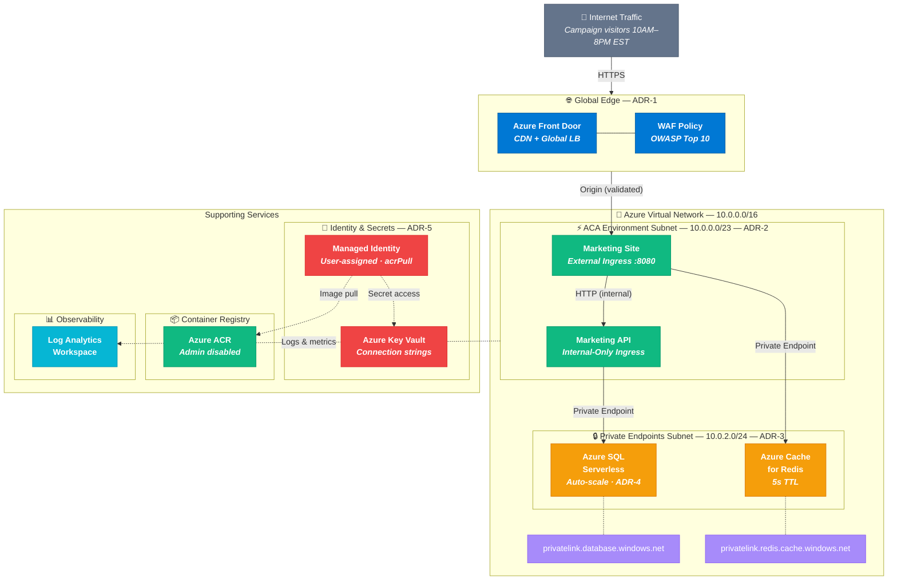

# Marketing Site — Infrastructure as Code

This repository contains the Terraform configuration to provision a secure, scalable, and highly available environment for the Marketing "Hello World" application on Azure.

## Strategic Context

This deployment is designed as a **Proof of Concept (POC)** to establish a reusable, standardized pattern for containerized workloads across the organization. It leverages modern cloud-native principles to ensure the architecture is resilient, cost-effective, and secure by default.

## System Architecture

The architecture is built on the principles of stateless compute tiers, edge caching, and strict network isolation.

- **Global Gateway:** Azure Front Door sits at the edge, providing Web Application Firewall (WAF) capabilities and CDN routing.
- **Compute:** Azure Container Apps (ACA) hosts the frontend and backend microservices.
- **Data & Cache:** Azure SQL (Serverless) and Azure Cache for Redis handle state and caching.
- **Security Perimeter:** The data layer is completely isolated from the internet using Azure Private Endpoints.
- **Secrets Management:** Azure Key Vault stores connection strings, accessed securely via User-Assigned Managed Identities.



## Architecture Decision Records (ADRs)

### ADR-1: Edge Ingress & Routing — Azure Front Door

**Context:** The site expects significant daytime traffic spikes and needs protection from common web vulnerabilities.

**Decision:** Implement Azure Front Door (AFD) with a Web Application Firewall (WAF) as the global entry point.

**Justification:** Exposing compute directly to the internet is an anti-pattern for production enterprise applications. AFD caches static assets at the edge, reducing origin load, while the WAF protects against OWASP Top 10 threats.

**Note on origin locking:** In a production hardening pass, the Marketing Site Container App should be configured to validate the `X-Azure-FDID` header to reject traffic that does not originate from our specific Front Door instance. ACA supports ingress IP restrictions via the `AzureFrontDoor.Backend` service tag as an additional layer of defense.

### ADR-2: Compute Platform — Azure Container Apps (ACA)

**Context:** The application expects traffic spikes from 10:00 AM to 8:00 PM EST and requires a reusable container deployment pattern.

**Decision:** Deploy the containers using Azure Container Apps.

**Justification:** ACA natively supports Kubernetes Event-driven Autoscaling (KEDA). This allows the infrastructure to scale horizontally in seconds based on concurrent HTTP requests during the campaign spikes, and scale down to zero (or a minimal baseline) at night to optimize costs. It removes the operational overhead of managing AKS while providing superior burst-scaling compared to traditional App Service Plans.

**Internal Routing:** The Marketing API is configured with internal-only ingress, meaning it cannot be reached from the public internet, further shrinking the attack surface.

### ADR-3: Network Security — Private Endpoints

**Context:** The SQL database is described as containing sensitive data.

**Decision:** Deploy Azure Private Endpoints for both Azure SQL Database and Azure Cache for Redis.

**Justification:** We disable all public network access to the database and cache. By using Private Endpoints, traffic between the Container Apps and the data layer travels exclusively over the Microsoft backbone network via the Virtual Network. Private DNS zones (`privatelink.database.windows.net` and `privatelink.redis.cache.windows.net`) are linked to the VNet so that the container apps resolve FQDNs to private IPs rather than blocked public endpoints.

### ADR-4: Data Layer — Azure SQL Serverless

**Context:** The database load will mirror the spiky traffic of the frontend.

**Decision:** Utilize Azure SQL Database configured with the Serverless compute tier.

**Justification:** The Serverless tier automatically scales compute resources (vCores and memory) in response to workload demand and auto-pauses during periods of inactivity. This guarantees performance during the 10-hour high-traffic window while aggressively minimizing costs during off-hours.

### ADR-5: Secrets Management — Managed Identities

**Context:** The applications require connection strings for Redis and SQL.

**Decision:** Store connection strings in Azure Key Vault and access them via User-Assigned Managed Identities.

**Justification:** No secrets are stored in Terraform state, Dockerfiles, or environment variables. The Container Apps assume the Managed Identity at runtime to securely fetch secrets from Key Vault, adhering to the principle of least privilege. Using a User-Assigned (rather than System-Assigned) identity ensures the identity and its role assignments exist before the Container Apps, avoiding circular dependencies in the Terraform dependency graph.

## Deployment Instructions

### Prerequisites

- [Terraform](https://developer.hashicorp.com/terraform/downloads) >= 1.5.0
- [Azure CLI](https://learn.microsoft.com/en-us/cli/azure/install-azure-cli) >= 2.50
- An Azure subscription with Contributor access

### 1. Clone and Authenticate

```bash
git clone https://github.com/YOUR_USERNAME/jules-site-mkt-infra.git
cd jules-site-mkt-infra

az login
az account set --subscription "YOUR_SUBSCRIPTION_ID"
```

### 2. Configure Variables

Edit `terraform/terraform.tfvars` and set your subscription ID:

```hcl
subscription_id = "your-azure-subscription-id"
```

### 3. Provision Infrastructure

The initial apply uses a placeholder container image to provision all infrastructure before the real images exist in ACR.

```bash
cd terraform
terraform init
terraform plan -var="sql_admin_password=YOUR_SECURE_PASSWORD"
terraform apply -var="sql_admin_password=YOUR_SECURE_PASSWORD"
```

### 4. Build and Push Container Images

From the root of your local `site-mkt` repository, build both images directly in ACR — no local Docker daemon is required.

```bash
ACR_NAME="<acr_login_server from step 3 output, e.g. acrmktprod>"

az acr build --registry $ACR_NAME --image marketing-site:latest --file Dockerfile.site .
az acr build --registry $ACR_NAME --image marketing-api:latest --file Dockerfile.api .
```

> You can retrieve the ACR name at any time by running `terraform output -raw acr_login_server` from the `terraform/` directory.

### 5. Deploy Application Images

Back in the `terraform/` directory of this repository, re-apply with the real image references:

```bash
ACR_SERVER=$(terraform output -raw acr_login_server)

terraform apply \
  -var="sql_admin_password=YOUR_SECURE_PASSWORD" \
  -var="site_image=${ACR_SERVER}/marketing-site:latest" \
  -var="api_image=${ACR_SERVER}/marketing-api:latest"
```

### 6. Verify

```bash
echo "Front Door URL: https://$(terraform output -raw front_door_endpoint)"
```

The site may take 1–2 minutes to become fully available while Front Door provisions the endpoint and the container apps start.

### 7. Teardown

```bash
terraform destroy -var="sql_admin_password=YOUR_SECURE_PASSWORD"
```

## Cost Considerations

The architecture is designed to minimize cost during the POC while maintaining production-grade patterns:

| Resource | Cost Strategy |
|---|---|
| **Azure SQL Serverless** | Auto-pauses after 60 min idle; scales from 0.5–2 vCores on demand |
| **Container Apps** | Scale-to-zero (min replicas = 0) during off-hours; KEDA scales based on actual load |
| **Azure Cache for Redis** | Basic/C0 tier — smallest footprint for POC validation |
| **Container Registry** | Basic SKU — sufficient for image storage without geo-replication |
| **Front Door** | Standard tier — WAF + CDN without Premium overhead |
| **Key Vault** | Standard SKU — minimal per-operation cost |

For a production graduation, consider upgrading Redis to Standard (SLA-backed replication), ACR to Standard (higher throughput), and Front Door to Premium (Private Link origins).

## State Management

For the purpose of this POC and easy local evaluation, the Terraform state is configured to run locally. For a production environment, state must be centralized, locked, and versioned. The `providers.tf` file includes a commented-out `backend "azurerm"` block demonstrating how this configuration seamlessly transitions to an Azure Storage Account with state locking.

## Terraform File Reference

| File | Purpose |
| --- | --- |
| `providers.tf` | AzureRM provider, version constraints, backend config |
| `main.tf` | Resource group, naming convention, common tags |
| `network.tf` | VNet, subnets (ACA + PE), NSGs |
| `identity.tf` | User-Assigned Managed Identity |
| `keyvault.tf` | Key Vault, RBAC role assignments |
| `acr.tf` | Container Registry, AcrPull role assignment |
| `database.tf` | SQL Server, Serverless DB, Private Endpoint, KV secret |
| `redis.tf` | Azure Cache for Redis, Private Endpoint, KV secret |
| `dns.tf` | Private DNS zones, VNet links |
| `container_apps.tf` | ACA environment, Log Analytics, Site + API apps |
| `frontdoor.tf` | Front Door profile, WAF policy, routing rules |
| `variables.tf` | Input variables with defaults |
| `outputs.tf` | Resource group, ACR, Front Door, Site/API FQDNs |
